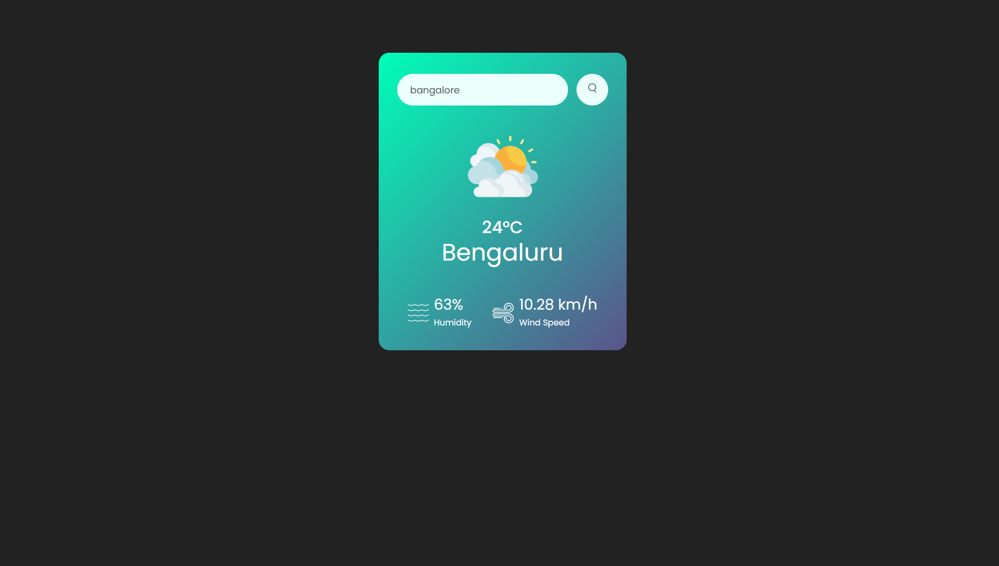

# 🌤️ Weather-JS

A simple and responsive weather web app built with **HTML**, **CSS**, and **JavaScript** that shows real-time weather information for any city. The app allows users to search for a city and displays the current weather conditions using a weather API.

---

## 📌 Features

- 🌍 Search weather by city name  
- 🌡️ Displays temperature, humidity, and weather condition  
- 🎨 Clean and responsive UI  
- ⚡ Fast and lightweight (Vanilla JavaScript)  
- 🌐 Works on all modern browsers  

---

## 🚀 Demo


---

## 🧠 How It Works

The app fetches real-time weather data from a public weather API using JavaScript’s `fetch()` method.  
The data is then dynamically displayed on the webpage.


---

## 🛠️ Technologies Used

- HTML5  
- CSS3  
- JavaScript (ES6+)  
- OpenWeatherMap API  

---

## ⚙️ Installation & Setup

1. **Clone the repository**
    ```bash
   git clone https://github.com/jatinn2602/weather-js.git
2. **Navigate to the project folder**
    ```bash
    cd weather-js
3. **Get a Weather API Key**
 - Sign up at https://openweathermap.org/
4. **Add API Key**
 - Open `script.js`
 - Replace:
    ```js
    const apiKey = "YOUR_API_KEY";
 with your actual key.

5. **Run the app**
 - Open `index.html` in your browser

--- 

## 🧩 Usage
 1. Enter a city name in the input box
 2. Press Enter or click the search button
 3. View current weather details instantly

---


If you want, I can also:
- 🔥 Add **GitHub badges**
- 📸 Add **screenshots section**
- 🌐 Customize it for **GitHub Pages deployment**
- 🧠 Rewrite it to look more **professional / resume-ready**

Just tell me 😄

